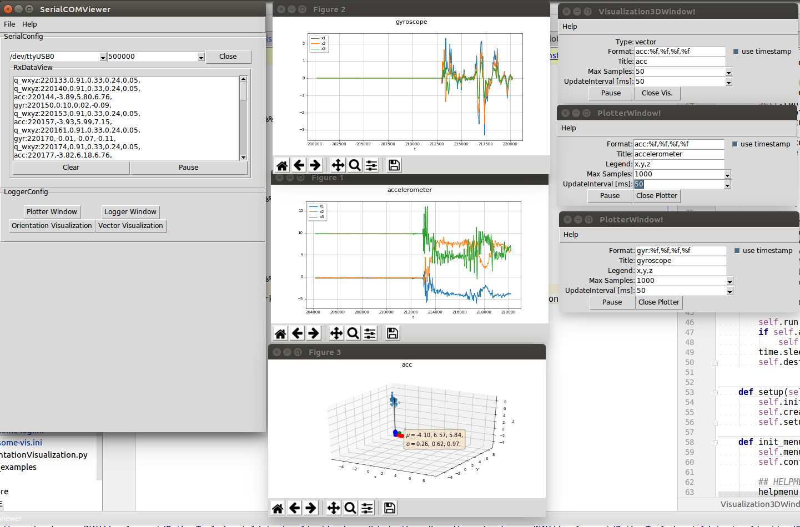
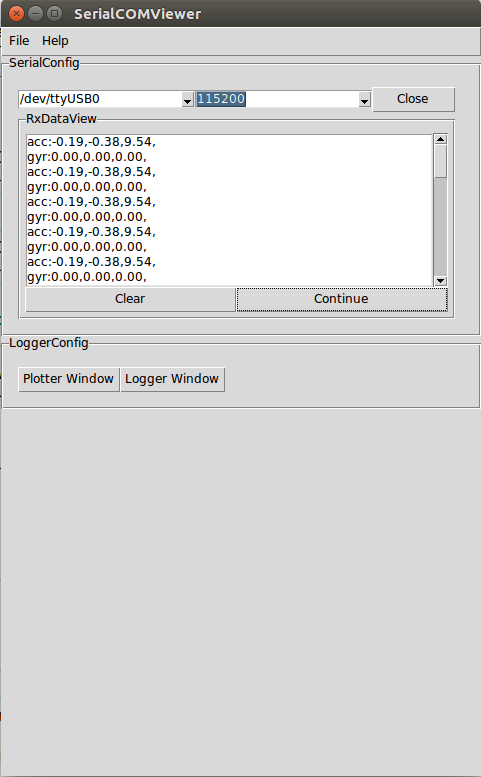
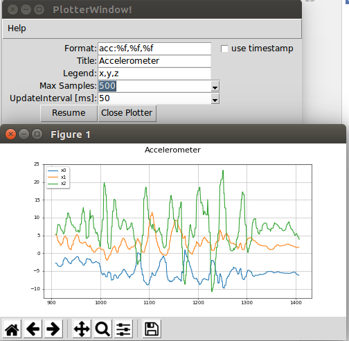
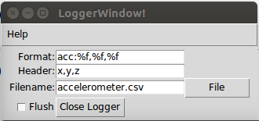
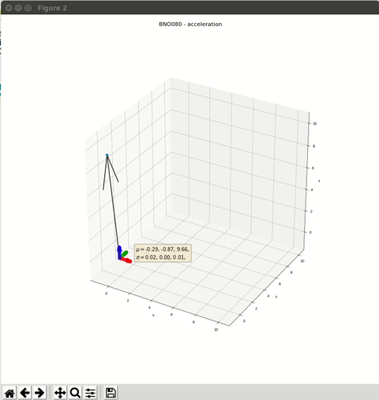
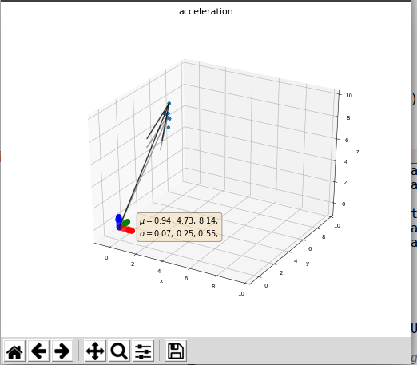
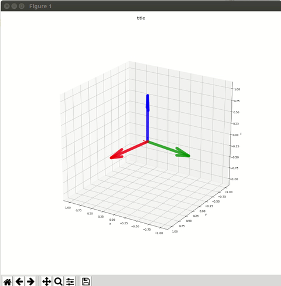
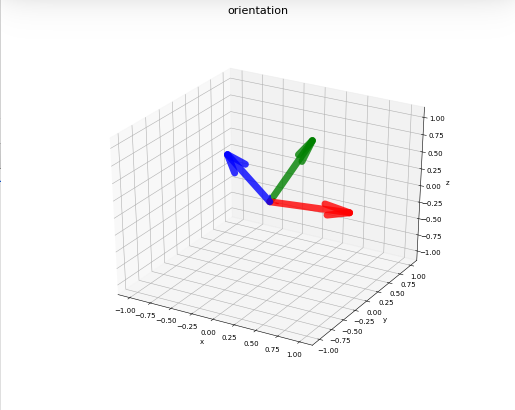

# (Another)SerialDataVisualization tool for Serial COM ports

(Another)SerialDataVisualization is a  tool to plot and save data steamed over a serial interface. 
A good overview on alternatives can be found on [StackExchange](https://arduino.stackexchange.com/questions/1180/serial-data-plotting-programs)

But what is the difference to existing ones? 
Well, the primary goal was flexibility without being forced to change major 
parts of the code in order to get it working with your custom problem. 

Most solutions struggle when the data is not streamed as excatly three column separated values. 
- What if your device is sending data from different senors, e.g. in my case an accelerometer and gyroscope? 
- How to differentiate between those values in the data stream?
- What happens if on value is a timestamp?

Furthermore, I am prefering cross-plattform solutions and fast prototyping capabilities for tools like these and Python is IMO a decent choice.

A generic solution to process incoming data from the serial interface is to parse a **C** like [scanf](http://www.cplusplus.com/reference/cstdio/scanf/?kw=scanf) format string, e.g. `acc:%f,%f,%f` or `timestamp=%d,triple:%f;%f;%f`.
Each data logger or data plotter instance will be provided by a **format string** (Format) and process the received data if it matches the 
specified format (please, don't take a step back by just reading **C/C++**, there is no need to be afraid).

## RUN

 **run application with**
1. `start.sh`

## Debugging/Developing
 
After cloning, run the `source setup-env.sh` that will
1. install a virtual environment `python-venv`
1.  activate the local interpreter `(venv)` or 
1. launch [PyCharm](https://www.jetbrains.com/pycharm/) from the root. ``` $ pycharm .``` and select a custom interpreter with the `python-venv`.

## Video Tutorial

[](https://youtu.be/NcSRnaUSXU4
 "Video Title")


## Overview

 

## Modifying/Extending it

In my opinion it is rather trivial to add an additional type of plot to the existing one. The lazy solution would be to directly modify the class `DataPlotter`.
A cleaner solution is to derive from that class and modify the `PlotterModel.create(...)` method, e.g an additional parameter to specify the desired plot type.
One nice example would be a pose including a trajectory (SE(3)) or an orientation (SO(3)) visualization. Maybe I will find some time to play a bit.
 
If you want to be able to send data back to the connected device, a good starting point is the `SerialCOMViewer` widget and 
the `SerialCOM_Widget` class. The later is using the `SerialDataSource` class that creates and holds the threaded `ThreadedSerialManager` to which
one can pass data to be sent.

I hope that I could encourage you to make your hands dirty on my code ;) 

## Requirements

[TK - Ubuntu and Python 3](https://tkdocs.com/tutorial/install.html): `sudo apt-get install python3-tk`
- pytransform3d
- numpy
- tkinter
- matplotlib
 
## SerialCOMViewer
 



Open a detected serial configuration with some predefined baud rate (can be modified, just change a value).
Once it is opened successfully, you should see data arriving in the `RxDataView` where you can `Pause`, `Continue` and `Clear` the 
preview.
In the `LoggerConfig` you can create any number of `PlotterWindow` or `LoggerWindow`. 
Once everything is set up, you can save the current configuration in `File->Save as` as `*.ini` file to be loaded the next 
time. 

 
## PlotterWindow
 
 
 
 Create a dynamic figure using matplot lib. 
 Data for the plot is received from a IDataSource (e.g. a SerialDataSource).
 Specify a format_str how each line received from the IDataSource should be interpreted.
 It is C++ <scanf> like: %f for float, %d for integer. Example: <mag:%f,%f,%f> would expect
 a line containing <mag> followed by three comma separated float values. It it fits it will be added
 to the buffer in the IDataSink, which is our DataPlotter, creating the figure.
 
- format_str: scanf string to parsed
- usetimestamp: specifies if the first element in <format_str> is a timestamp (x-axis)
- title: title of the figure
- legend: how the axis should be labeled
- max_sample: reduces the number of samples in the figure, dropping oldest ones
- pause/resume: pauses/resumes the refreshing of the plot - time to save figures!
- create/close: creates a new or destroys a plot.

## LoggerWindow


 
Store the content received from a IDataSource in a CSV file.

The <data/msg/line> is received from a IDataSource(e.g. a SerialDataSource).
Specify a format_str how each line received from the
IDataSource should be interpreted. It is C <scanf> like:
%f for float, %d for integer. Example: <mag:%f,%f,%f> would expect
a line containing <mag> followed by three comma separated
float values. It it fits it will be added to the buffer in the IDataSink,
which is our DataLogger, writing lines in a specified file.
Options:
+ format_str: <scanf> string to parsed
+ header: header of the file: e.g. <x,y,z>
+ filename: name of the desired csv <file>
+ create/close: creates a new or destroys a file.
+ flush: refreshes file on drive (slower, cause each new line will be written into the file)

## VectorPlot3D


<!---  -->

## OrientationPlot


<!--- -->


## License

`sharing is caring` 
[GNU Lesser General Public License v3.0](https://choosealicense.com/licenses/lgpl-3.0/) 
